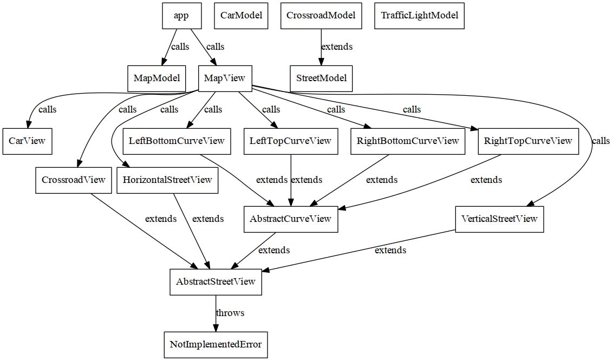

# js13kgames 2016

The topic of js13kgames competition in 2016 is *glitch*.

# Live demo

[https://ryuno-ki.github.io/js13kgames-2016/](https://ryuno-ki.github.io/js13kgames-2016/)

# Dependency tree



# Left to do

 * Map algorithm
 * Data binding
 * Cosmic radiation on traffic light (aka "Glitch")
 * Scores
 * Sharing scores on twitter
 * Easter egg tiles

# Lessens learned

## Creating SVG Elements through JavaScript

In case you ever want to create `<svg>`s on the fly and wonder, why the heck
the `viewBox` property isn't displayed properly (that is, appears lowercased in
web browser) it is because you need to use the following:
```js
var svgNs = 'http://www.w3.org/2000/svg';
var svgNode = document.createElementNS(svgNs, 'svg');
svgNode.setAttribute('viewBox', '0 0 100 100');
svgNode.setAttribute('xmlns', svgNs);  // This may be not needed
svgNode.setAttribute('version', svgNs);  // May be superfluos
svgNode.setAttribute('height', '60');  // Default height in DOM
svgNode.setAttribute('width', '60');  // Default width in DOM

// createElementNS is needed for all descendors of `svg` nodes as well:
var g = document.createElementNS(svgNs, 'g');  // "group" element
svgNode.appendChild(g);
```
SVG is an XML format. For XML you need to declare where to find the definitions
of its elements. SVG has its stated at the URL in `svgNs` above.

## Removing whitespace between SVG nodes

Once you place several `<svg>`s next to each other respectively on top, you'll
notice that there is a small whitespace gap between them.

That is caused by `<svg>` rendered in DOM as `display: inline;`.

There are several solutions described in this CSS-Tricks article
[citation needed]. I went for `style="display:block;float:left;"` them
(in CSS).

## Map generation

Don't underestimate map algorithms.

# License

GPL v3
